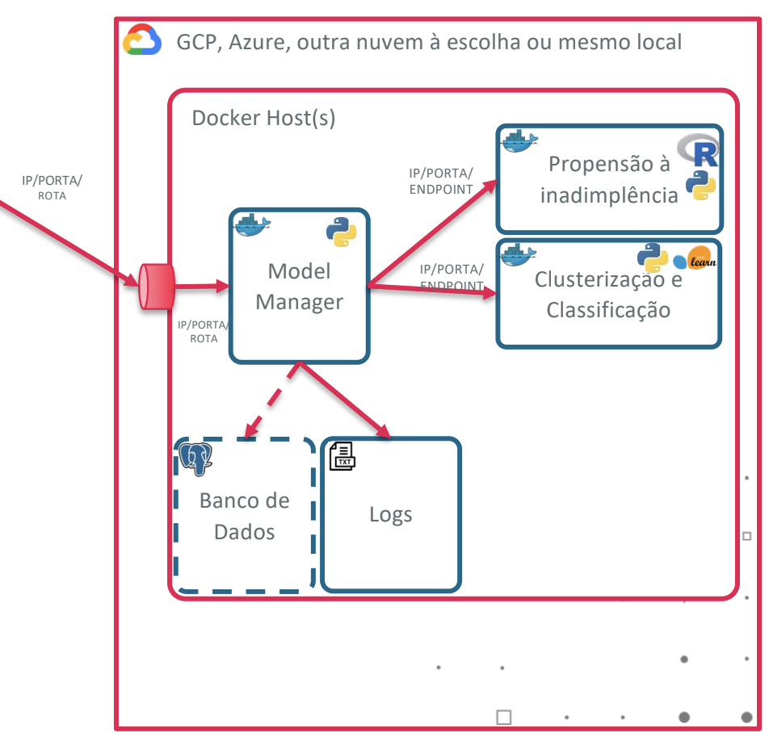

# MLOps - Quantum Finance

A Startup QuantumFinance é uma Fintech que está entrando no mercado para competir com grandes players da área.

Durante nosso MBA Data Science & Artificial Intelligence aplicaremos ciência de dados e inteligência artificial para fomentar a expansão da Startup, em seus diversos segmentos e áreas de negócios.



## Configurando e testando o ambiente localmente
1. Para criar a imagem do modelo para testarmos, na pasta raiz, execute:
```bash
docker build -t defaultpropensityapi -f part_1/dockerbuilds/Dockerfile part_1/docker/
```
2. Você pode rodar individualmente um container da seguinte forma:
```bash
docker run -p 8080:8080 --name defaultpropensityapi defaultpropensityapi
```
3. Após testar que o modelo funciona corretamente, execute o setup de ambiente com:
```bash
bash setup.sh
```

## Criando o ambiente na Cloud
Caso queira usar a cloud, crie uma VM com as especificações mínimas:


Para os testes utilizei a VM acima no Azure (Standard B1ms (1 vcpu, 2 GiB memory)). Siga então os passos para gerar o ambiente:
1. No terminal da VM rode os comandos que estão em `part_4/cloud/setup.sh`. Esses comandos atualizarão a máquina e deixará o docker pronto para uso.
2. Em seguida envie o repositório para dentro de sua VM com git clone.
3. Na raiz no projeto execute o comando `sudo bash setup.sh` isso criará todo o ambiente.
