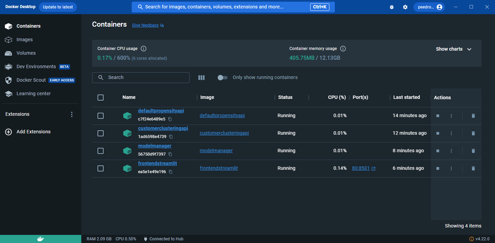
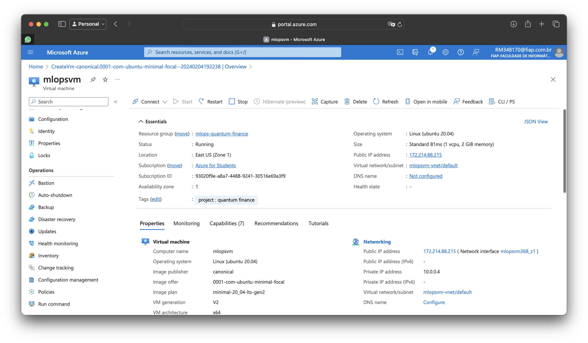
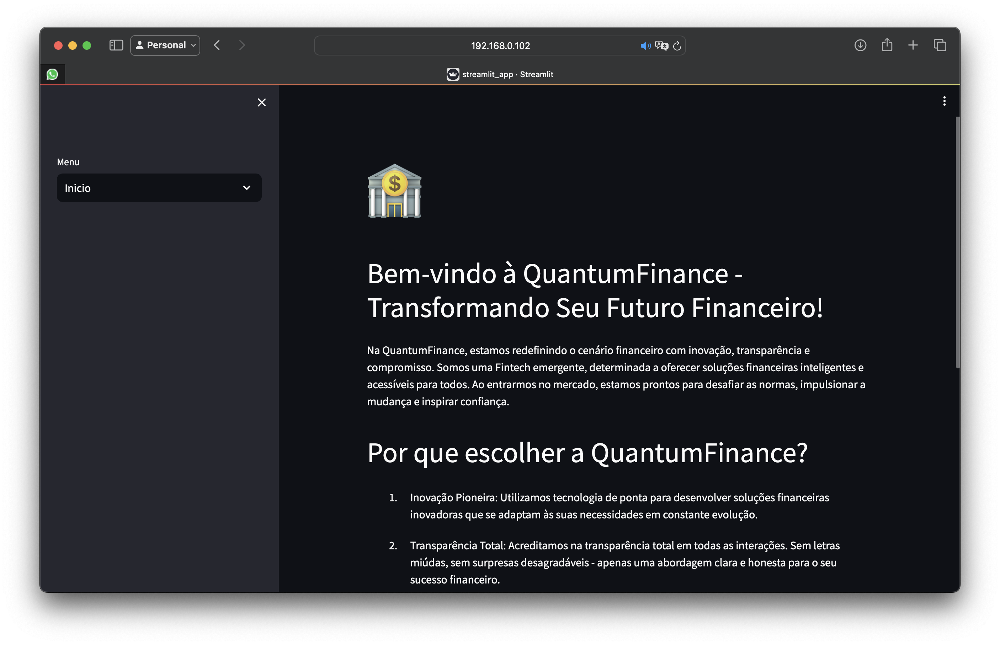

# MLOps - Quantum Finance

A Startup QuantumFinance é uma Fintech que está entrando no mercado para competir com grandes players da área.

Durante nosso MBA Data Science & Artificial Intelligence aplicaremos ciência de dados e inteligência artificial para fomentar a expansão da Startup, em seus diversos segmentos e áreas de negócios.

## Configurando e testando o ambiente localmente


1. Para criar a imagem do modelo para testarmos, na pasta raiz, execute:
```bash
docker build -t defaultpropensityapi -f part_1/dockerbuilds/Dockerfile part_1/docker/
```
2. Você pode rodar individualmente um container da seguinte forma:
```bash
docker run -p 8080:8080 --name defaultpropensityapi defaultpropensityapi
```
3. Após testar que o modelo funciona corretamente, execute o setup de ambiente com:
```bash
bash setup.sh
```

## Criando o ambiente na Cloud
Caso queira usar a cloud, crie uma VM com as especificações mínimas:


Para os testes utilizei a VM acima no Azure (Standard B1ms (1 vcpu, 2 GiB memory)). Siga então os passos para gerar o ambiente:
1. No terminal da VM rode os comandos que estão em `part_4/cloud/setup.sh`. Esses comandos atualizarão a máquina e deixará o docker pronto para uso.
2. Em seguida envie o repositório para dentro de sua VM com git clone.
3. Na raiz no projeto execute o comando `sudo bash setup.sh` isso criará todo o ambiente.

## Testando a solução corporativa

> Construímos uma simulação de aplicação usando o Streamlit

# Repositório base
Esse trabalho é baseado nas aulas de [Elthon Manhas de Freitas](https://www.linkedin.com/in/elthonmf/). E em seu repositório: [Plataformas Cognitivas Docker](https://github.com/elthonf/plataformas-cognitivas-docker)

# Contribuições

<table>
  <tbody>
    <tr>
      <td align="center" valign="top">
        </br>
        <span> <a href="https://www.linkedin.com/in/gdnf">Gabriel Nascimento</a> </span>
        <p>Contributor</p>
      </td>
      <td align="center" valign="top">
        </br>
        <span> <a href="https://www.linkedin.com/in/matheusromão">Matheus Romão</a> </span>
        <p>Contributor</p>
      </td>
      <td align="center" valign="top">
        </br>
        <span> <a href="https://www.linkedin.com/in/sabrina-otoni-da-silva-22525519b/">Sabrina Otoni</a> </span>
        <p>Contributor</p>
      </td>
     </tr>
  </tbody>
</table>
